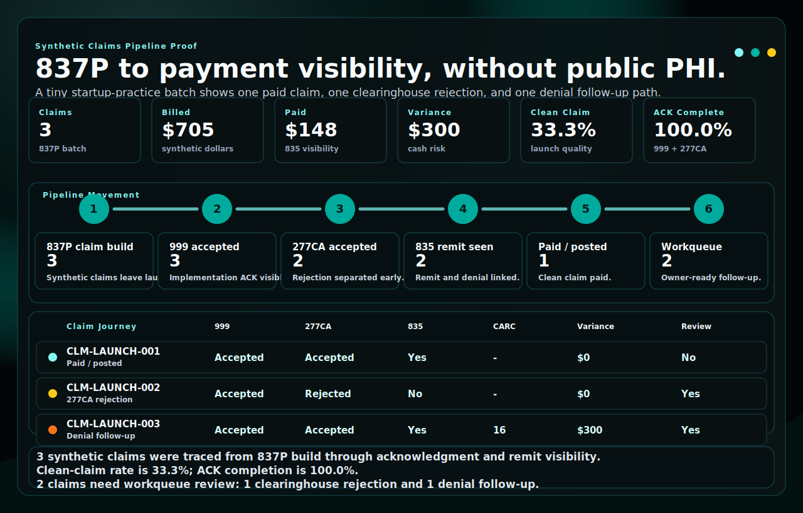

# RevCycleMGMT Claims Pipeline

Synthetic, local-first reference pipeline for startup-practice revenue cycle workflows: 837 claim intake, 999/277CA clearinghouse acknowledgments, 835 remittance reconciliation, CARC/RARC denial patterns, and dashboard-ready RCM metrics.

This repository is designed as a public RevCycleMGMT portfolio proof. It shows how a clinician founder's first revenue operating layer can be organized without using production claims, patient records, PHI, payer credentials, or clearinghouse credentials.



---

## Highlights
- EDI/X12 scope: 837P/837I/835/999/277CA, with planned hooks for 270/271 and 276/277.
- Clearinghouse visibility: acknowledgement tracking, route timing, and payer-response monitoring.
- Revenue cycle model: `claims_header`, `claims_line`, `adjudication`, `payments`, `acknowledgments`, `claim_status`, and `kpi_daily`.
- Denial intelligence: CARC/RARC fields mapped into follow-up-ready records.
- Dashboard starter: claim volume, billed/allowed/paid amounts, remits, acknowledgments, denial rate, payment variance, and claim workqueue export.
- Secure ingress: SFTP, S3, Azure Blob, and BigQuery onboarding runbooks with evidence templates.
- Interoperability bridge: synthetic HL7 PID helper for claim-prep context, masked by default for demo safety.
- Traceability: deterministic hashes connect synthetic raw X12 snapshots to normalized rows.
- Startup launch scenario: one paid claim, one clearinghouse rejection, and one denial/remit follow-up path.
- Generated visual proof: a GitHub-rendered SVG claim journey built from the demo mart outputs.
- Safety boundary: demo data only; no PHI, credentials, production claims, or customer data.

---

## Visual Proof Artifact

The README visual above is generated from the same synthetic ETL run described in the quickstart. It is not a static marketing screenshot. The proof artifact shows exactly what a buyer needs to understand first:

| Visual lane | What it proves |
| --- | --- |
| KPI cards | The batch volume, billed amount, paid amount, payment variance, clean-claim rate, and acknowledgment completion are calculated from demo marts. |
| Pipeline movement | The synthetic batch moves from 837P claim build to 999, 277CA, 835, payment posting, and workqueue routing. |
| Claim journey table | One claim is paid, one is rejected by 277CA, and one reaches denial follow-up with CARC 16. |
| Executive readout | The output translates technical X12 events into a plain operating summary for a clinician founder or revenue lead. |

Regenerate it locally after running the ETL:

```bash
python -m revcyclemgmt_claims.pipelines.proof_artifacts --warehouse warehouse --out output_demo
cp output_demo/claims_pipeline_map.svg docs/assets/claims-pipeline-map.svg
```

## Architecture

```mermaid
%%{init: {'theme':'dark','themeVariables': { 'primaryColor': '#0f172a', 'primaryTextColor': '#e5e7eb', 'lineColor': '#94a3b8', 'fontSize': '12px' }}}%%
flowchart LR

subgraph Provider Systems
  EHR[EHR/PM (e.g., Epic Resolute HB/PB)\nUB-04/CMS-1500 data]
end

subgraph Clearinghouse(s)
  CH1[Change Healthcare]
  CH2[Waystar]
  CH3[Availity]
end

subgraph Ingestion Layer
  W1[Watchers (SFTP/AS2/API)]
  V[Validation: envelope, ISA/GS/ST]
  ACK[ACK Monitor\n999 / 277CA]
end

subgraph Parsing & Normalization
  P1[Parse X12 837P/I/D]
  P2[Parse 835 (ERA)]
  MAP[Map to canonical model:\nclaims_header, claims_line,\nadjudication, payments, CARC/RARC]
end

subgraph Storage & Marts
  STG[(Raw/Staging)]
  DQ[Claim workflow checks]
  MART[(Analytics Mart:\nRCM KPIs)]
end

subgraph Apps & Ops
  DEN[Denials Intelligence\nCARC->root cause]
  DB[Dashboards & SLAs]
  EXP[Exports: posting files, workqueues]
  ALERT[Ops alerts\n(missed 999/277CA, payer lag)]
end

EHR -- 837 --> CH1 & CH2 & CH3
CH1 & CH2 & CH3 -- 999/277CA/835 --> W1
W1 --> V --> ACK
ACK --> ALERT
V --> P1 & P2 --> STG --> MAP --> DQ --> MART --> DB
MAP --> DEN --> EXP
```

---

## Quickstart (local demo)
```bash
# 1) Create & activate a venv
python -m venv .venv
# Windows: .venv\Scripts\activate
# macOS/Linux:
source .venv/bin/activate

# 2) Install minimal deps
pip install -e .

# 3) Run the demo ETL on sample files
python -m revcyclemgmt_claims.pipelines.ingest_edi --inbox tests/sample_data --warehouse warehouse
python -m revcyclemgmt_claims.pipelines.build_marts --warehouse warehouse
python -m revcyclemgmt_claims.pipelines.proof_artifacts --warehouse warehouse --out output_demo

# 4) Launch the dashboard
streamlit run apps/dashboard/rcm_app.py
```

The demo parser recognizes the sample 837, 835, 999, and 277CA-style files and emits synthetic normalized records. The current launch scenario demonstrates three different outcomes:

1. `CLM-LAUNCH-001` moves cleanly from 837 to 999/277CA to 835 payment visibility.
2. `CLM-LAUNCH-002` is rejected at the 277CA stage and routes to clearinghouse follow-up.
3. `CLM-LAUNCH-003` reaches the remit stage but is denied with CARC 16 and routes to denial follow-up.

Real production use would replace the adapter in `parsers/` with a validated X12 translator such as `pyx12`, Bots, or an enterprise EDI parser.

## What This Proves

For a non-technical buyer, this demo proves the operating model:

1. Claim-related X12 files land in a controlled inbox.
2. The pipeline saves a raw copy for traceability.
3. The parser converts the files into clean operational tables.
4. Acknowledgments, remits, payments, and denial signals are linked into one claim journey.
5. A dashboard can show which claims are paid, rejected, denied, waiting, or ready for follow-up.
6. Intake runbooks show how a real engagement would be controlled before any production file is accepted.

That is the RevCycleMGMT portfolio story: make the claims pipeline easier to see, control, and improve.

---

## Generated Artifacts

| Artifact | Purpose |
| --- | --- |
| `output_demo/claims_pipeline_summary.json` | Buyer-readable synthetic proof model with metrics, stage counts, claim journey rows, and executive readout. |
| `output_demo/claims_pipeline_map.svg` | Generated native SVG proof artifact from the demo marts. |
| `docs/assets/claims-pipeline-map.svg` | README-facing copy of the generated SVG. |

---

## Repository layout
```
.
├── apps/
│   └── dashboard/               # Streamlit RCM dashboard
├── config/
│   ├── .env.example             # environment template, no secrets
│   ├── ingress/                 # secure ingress examples
│   ├── pipeline.example.yml     # connection + routing shape
│   └── mappings/carc_groups.csv # CARC to root cause mapping
├── database/
│   └── schemas/                 # warehouse DDL examples
├── docs/
│   ├── 00-business/             # mission, scope, and positioning
│   ├── 01-architecture/         # workflow architecture
│   ├── 02-governance/           # safeguards and security boundaries
│   ├── 03-website/              # portfolio card copy
│   ├── 04-runbooks/             # local demo, secure ingress, evidence templates
│   ├── 05-migration/            # portfolio scope and disposition decisions
│   └── assets/                  # README-rendered proof SVG
├── output_demo/                 # generated synthetic proof artifacts
├── src/
│   └── revcyclemgmt_claims/
│       ├── interoperability/     # synthetic HL7/FHIR claim-prep helpers
│       ├── parsers/             # X12 parser adapters
│       └── pipelines/           # ingest, mart build, proof artifacts, utilities
├── tests/
│   ├── test_mapping.py
│   └── sample_data/             # tiny fake 837/835/ACKs
├── .github/workflows/ci.yml
├── pyproject.toml
├── SECURITY.md
├── requirements.txt
├── LICENSE
└── README.md
```

---

## Environment
Copy `config/.env.example` to `.env` only for local experiments. Do not commit `.env`. The demo does not require secrets.

---

## Operational Safeguards

This scaffold is healthcare-aware but is not a compliance certification, legal opinion, clearinghouse certification, or payer companion-guide implementation. See `docs/02-governance/operational-safeguards.md` and `SECURITY.md`.

Production use would require formal security review, BAAs where appropriate, payer/clearinghouse companion-guide validation, access controls, monitoring, retention rules, incident response, and no PHI in logs.

---

## Roadmap
- Production-ready adapters for pyx12, Bots, or an enterprise EDI parser
- Eligibility (270/271) and status (276/277) enrichment joins
- Human-reviewed claim edit and denial follow-up workqueues
- Payer companion-guide drift checks
- Prior authorization joins and payer lag benchmarking
- Claim status workqueue filters for accepted, paid, denied, and waiting-for-remit claims
- Dashboard screenshots and hosted synthetic demo walkthrough
- Separate RevCycleMGMT-branded portfolio repositories for 835 reconciliation, acknowledgment monitoring, denial taxonomy, eligibility cache, and capability statement examples
- See `docs/06-portfolio/edi-x12-implementation-roadmap.md` for the proposed EDI/X12 implementation portfolio, including Optum-style clearinghouse API adapter planning.

---

## License
MIT — see LICENSE.
